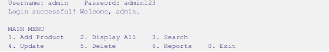
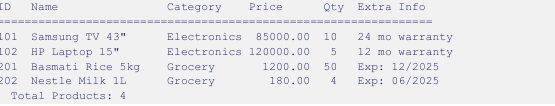
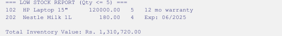

# Smart Inventory Management System

A console-based Inventory Management System developed in C++ using Object-Oriented Programming principles.

## Screenshots

### Login & Main Menu

### Display Products

### Reports

## Features
- User Login System
- Add Products
- Update Products
- Delete Products
- Search Products
- Inventory Reports
- Low Stock Alerts
- File Storage using CSV

## OOP Concepts Used
- Abstraction
- Encapsulation
- Inheritance
- Polymorphism
- Friend Functions
- Operator Overloading
- Static Members
- Constructors and Destructors

## Technologies
- C++
- File Handling
- Object-Oriented Programming

## Author
Naima Kanwal
Software Engineering Student

